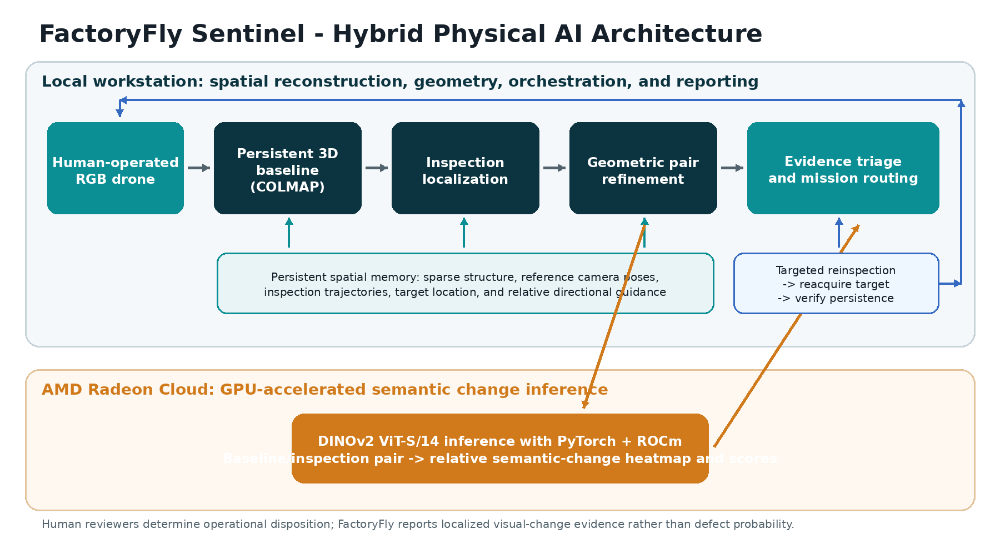
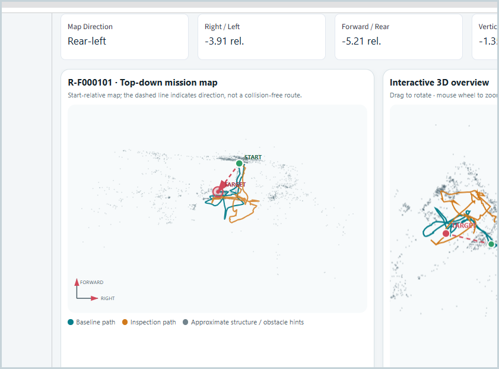
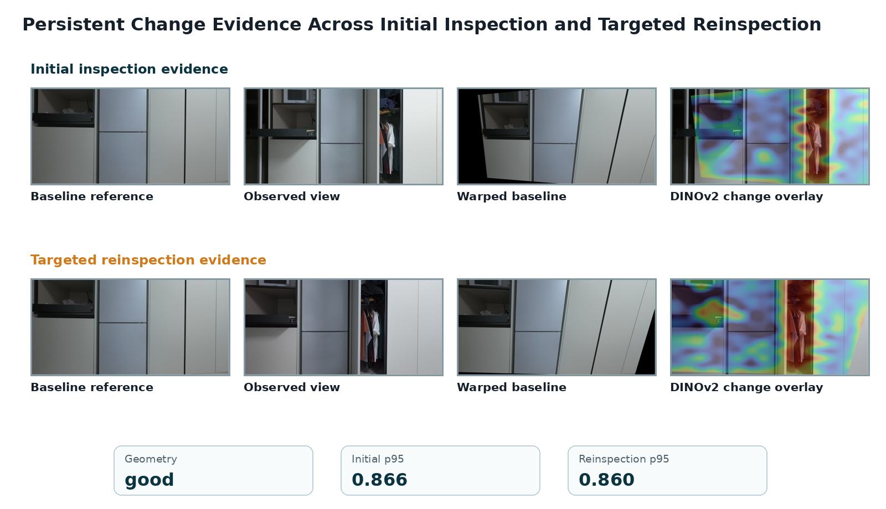

# FactoryFly Sentinel
## Human-Guided Physical AI for Active Factory Inspection

**Technical Report**  
AMD AI DevMaster Hackathon 2026 - Track 3  
**Author:** Jaewon Lee  
**Team:** Solo participant  
**Date:** 4 August 2026  
**Prototype version:** v7.3.13

> FactoryFly Sentinel converts repeated human-operated drone inspections into localized visual-change evidence, routes uncertain observations to targeted reinspection, and produces a self-contained report for human review.

## Executive Summary

Industrial inspection teams can collect large volumes of RGB video, but reviewing every frame and returning to the exact location of an uncertain observation remain costly and error-prone. FactoryFly Sentinel is a human-guided Physical AI prototype that adds persistent spatial memory and an evidence-driven reinspection loop to ordinary drone footage.

The system builds a COLMAP-based 3D baseline from a reference flight, localizes a later inspection inside the same coordinate system, geometrically aligns comparable views, and sends geometry-ready image pairs to an AMD Radeon GPU on Radeon Cloud. A pretrained open-source DINOv2 ViT-S/14 model runs through PyTorch and ROCm to produce relative semantic-change heatmaps and scores. FactoryFly then clears stable observations, records well-supported changes, and converts geometrically uncertain high-change evidence into a targeted reinspection mission. The follow-up view is reacquired and analyzed again to determine whether the visual change persists.

The demonstrated run produced 18 analyzed evidence entries, automatically cleared 10 stable observations, recorded 4 confirmed visual findings, executed 1 targeted reinspection, and ended with 0 unresolved findings. The reinspection target was reacquired with **good** geometry; the initial p95 score was **0.866** and the reinspection p95 score was **0.860**, supporting a persistent visual change.

All demonstration data were self-collected in a private indoor environment. No employer data, employer code, confidential factory information, or proprietary company assets are included.

## 1. Target Application

### 1.1 Problem

Repeated visual inspection is common in factories, warehouses, utilities, and large facilities. A human operator can fly a drone through an area, but three practical problems remain:

1. Video volume grows faster than reviewers can inspect it.
2. A later flight rarely reproduces the same camera pose exactly.
3. When evidence is uncertain, the operator needs actionable guidance about where to return.

Conventional frame-difference methods are fragile under viewpoint, illumination, parallax, motion blur, and temporary occlusion. A useful inspection system therefore needs both spatial context and semantic comparison.

### 1.2 Proposed Application

FactoryFly Sentinel provides a complete perception-decision-reobservation workflow:

- A human operates an RGB drone.
- A baseline flight becomes persistent 3D spatial memory.
- A later inspection is localized inside that memory.
- Comparable baseline and inspection views are geometrically refined.
- AMD-accelerated DINOv2 inference generates visual-change evidence.
- Evidence is triaged into stable, confirmed, or reinspection-required states.
- The system generates a targeted spatial mission for uncertain evidence.
- The follow-up observation is reacquired and analyzed.
- A self-contained HTML report is produced for human review.

FactoryFly does **not** claim to diagnose a defect, determine safety, or classify operational acceptability. It reports localized visual-change evidence and evidence quality; a human reviewer assigns the final operational disposition.

## 2. System Architecture and Solution Design

The prototype uses a hybrid architecture. Spatial reconstruction, geometric processing, workflow orchestration, and the Streamlit interface run on a Windows workstation. The core semantic-change inference stage runs on an AMD Radeon GPU in Radeon Cloud using PyTorch and ROCm.

### 2.1 Thirteen-Step Workflow

| Step | Stage | Purpose |
|---:|---|---|
| 1 | Baseline Registration | Sample a reference flight and construct the persistent COLMAP baseline. |
| 2 | Baseline Spatial Memory | Store sparse structure, camera poses, trajectories, and relative coordinates. |
| 3 | Inspection Registration | Register a new inspection video and optional flight telemetry. |
| 4 | Spatial Localization | Add inspection camera poses to the fixed baseline coordinate system. |
| 5 | Localization Result | Review registration coverage and pose continuity. |
| 6 | Pair Refinement | Retrieve nearby baseline views and refine geometry for each inspection frame. |
| 7 | Pair Result | Select geometry-ready pairs for semantic analysis. |
| 8 | AMD Analysis | Package and execute DINOv2 inference on Radeon Cloud through ROCm. |
| 9 | AMD Result | Review heatmaps, relative scores, and analysis artifacts. |
| 10 | Change Triage | Clear stable evidence, confirm strong evidence, and route uncertainty. |
| 11 | Reinspection Mission | Generate a spatial target and human-readable return guidance. |
| 12 | Reinspection Analysis | Reacquire the target and test whether the change persists. |
| 13 | Final Report | Generate a self-contained HTML, Markdown, and JSON evidence package. |

### 2.2 Spatial Memory

The baseline coordinate system is preserved throughout the workflow. Inspection poses are added without bundle adjustment or triangulation, preventing the active baseline frame from drifting. Spatial outputs are expressed in reconstructed relative units, not calibrated metres. The 3D mission view therefore provides approximate structure and directional context rather than a certified navigation or obstacle map.

### 2.3 Local and Remote Responsibilities

**Local workstation**

- Video registration and frame sampling
- COLMAP sparse reconstruction
- Inspection image registration
- Pose-based retrieval and geometric refinement
- Triage, mission generation, user interface, and reporting
- Secure packaging and orchestration of remote inference

**AMD Radeon Cloud**

- PyTorch + ROCm runtime
- DINOv2 ViT-S/14 feature inference
- Relative semantic-change scoring
- Generation of heatmap and machine-readable result artifacts

## 3. Dataset

### 3.1 Data Source

The evaluation uses a self-built RGB video dataset recorded in a private indoor environment. It contains three sequences:

- **Baseline flight:** reference appearance and spatial structure
- **Initial inspection:** repeated flight containing visible scene changes
- **Targeted reinspection:** follow-up flight used to reacquire one uncertain target

No model training or fine-tuning was performed. The dataset was used only for reconstruction, localization, geometric evaluation, and inference-time change analysis.

### 3.2 Demonstration Dataset Statistics

| Stage | Metric | Result |
|---|---|---:|
| Baseline | Sampled frames | 158 |
| Baseline | Registered cameras | 91 |
| Baseline | Registration rate | 57.59% |
| Baseline | Sparse 3D points | 5,499 |
| Inspection localization | Input frames | 47 |
| Inspection localization | Registered frames | 18 |
| Inspection localization | Registration rate | 38.3% |
| Inspection localization | Longest continuous registered run | 16 frames |
| Pair refinement | Candidate pairs evaluated | 90 |
| Pair refinement | AMD-ready pairs | 12 |
| Pair refinement | High-confidence pairs | 8 |
| Pair refinement | Median reprojection error | 0.962 px |

The dataset intentionally includes difficult conditions such as viewpoint mismatch, occlusion, parallax, low-texture surfaces, and changed object states. These conditions test whether the system can distinguish semantic evidence from inadequate geometry.

### 3.3 Data and Privacy Compliance

- All source footage was captured by the participant.
- The environment is a private indoor space.
- No faces, confidential documents, company systems, or employer intellectual property are required for the demonstration.
- Public submission assets can be reduced or redacted without changing the technical method.
- The DINOv2 checkpoint and other third-party dependencies remain subject to their respective open-source licences.

## 4. Algorithms and Implementation

### 4.1 Baseline Reconstruction

FactoryFly samples frames from the baseline RGB video and uses COLMAP feature extraction, matching, and sparse reconstruction. Among multiple sparse models, the model with the strongest registration result is selected as the persistent baseline.

The baseline stores:

- Sparse 3D points
- Registered reference camera poses
- Reference frame identities
- Baseline trajectory
- Start position and relative orientation context

### 4.2 Inspection Localization

Inspection frames are registered against the existing baseline model through COLMAP image registration. The baseline geometry is held fixed. This produces inspection camera poses in the same coordinate system as the reference flight.

Localization quality is reported through:

- Registered-frame count and percentage
- Failed-frame list
- Longest continuous localized run
- Baseline and inspection pose exports
- Timeline and trajectory visualization

### 4.3 Geometric Pair Refinement

For each localized inspection frame, FactoryFly retrieves the top-K nearest baseline camera candidates. The demonstrated run used **K = 5**.

Each candidate is evaluated using:

1. Mutual-ratio SIFT feature matching
2. Fundamental Matrix RANSAC
3. Homography RANSAC
4. Valid overlap estimation
5. Reprojection error
6. Combined refinement quality scoring

The run evaluated 90 candidates and produced:

- 3 Excellent pairs
- 5 Good pairs
- 4 Usable pairs
- 6 Poor pairs
- 12 non-poor, AMD-ready pairs
- Median reprojection error of 0.962 pixels

Homography is treated as a planar approximation. Geometry quality gates semantic interpretation so that high visual difference alone is not mistaken for reliable change evidence.

### 4.4 AMD-Accelerated DINOv2 Change Analysis

Geometry-ready image pairs are packaged locally and transferred to Radeon Cloud. The remote environment executes a DINOv2 ViT-S/14 checkpoint using PyTorch on ROCm.

For each pair, the inference stage generates:

- Baseline reference image
- Inspection image
- Warped baseline image
- DINOv2 relative semantic-change overlay
- Aggregate score statistics, including p95
- CSV and JSON artifacts for downstream triage

The heatmap represents relative semantic difference within the valid geometric overlap. Warm colours are **not** calibrated defect probabilities or severity scores.

### 4.5 Evidence Triage

FactoryFly combines semantic evidence with geometric quality. In the demonstrated workflow, the evidence-routing policy used:

- Confirmed-change p95 threshold: **0.62**
- Uncertain-change p95 threshold: **0.70**

These are demonstration routing thresholds, not calibrated probabilities. Geometry and score jointly determine whether evidence is:

- Automatically cleared as stable
- Recorded as a confirmed visual change
- Routed to targeted reinspection

### 4.6 Targeted Reinspection and Change-Tolerant Reacquisition

A reinspection mission targets the baseline reference camera location associated with uncertain evidence. The mission view includes the baseline and inspection trajectories, sparse spatial context, relative X/Y/Z directions, and the target location.

Reacquisition is intentionally change-tolerant. A large physical change can make direct baseline-to-reinspection matching weak. FactoryFly therefore accepts either:

- A usable direct baseline-to-reinspection match, or
- A usable initial-inspection-to-reinspection match

In the second case, the system composes the baseline-to-initial and initial-to-reinspection homographies and crops the wide follow-up frame to the projected reference field of view. DINOv2 still compares the original baseline evidence with the reacquired follow-up view.

### 4.7 Reporting

The final self-contained HTML report contains:

- Summary counts
- Confirmed, cleared, and unresolved sections
- Baseline, inspection, warped, and heatmap evidence
- Reinspection geometry and p95 metrics
- Interactive 3D spatial context
- Human disposition and reviewer-note fields
- Explicit scope and interpretation guidance

The report can be opened without a running server because evidence images and interactive data are embedded.

## 5. AMD Radeon GPU and ROCm Utilization

AMD Radeon GPU acceleration is used for the core AI perception stage.

### 5.1 Execution Flow

1. Local geometry-ready pairs are packaged.
2. FactoryFly transfers the package to a Radeon Cloud workspace.
3. A ROCm-enabled Python environment loads the open-source DINOv2 model.
4. Feature inference and semantic comparison execute on the AMD Radeon GPU.
5. Result images, score tables, run metadata, and benchmarks are returned to the local system.
6. Local triage and reporting consume the returned artifacts.

### 5.2 Why the GPU Stage Matters

DINOv2 feature extraction is the most computationally intensive AI component in the prototype. Moving this stage to Radeon Cloud demonstrates that the semantic perception layer can execute on AMD hardware while the spatial and UI components remain lightweight and modular.

### 5.3 Open-Source and Deployment Characteristics

- Core AI inference uses an open-source model.
- PyTorch executes through the ROCm software stack.
- No closed-source online API is used for core change inference.
- The remote inference package is reproducible through explicit environment, model, and dependency configuration.
- Local and remote responsibilities are isolated, making the Radeon inference component independently testable.

## 6. Results and Evaluation

### 6.1 End-to-End Run Summary

| Metric | Result |
|---|---:|
| Analyzed evidence entries | 18 |
| Stable observations automatically cleared | 10 |
| Confirmed visual findings | 4 |
| Targeted reinspections | 1 |
| Cleared after reinspection | 0 |
| Unresolved findings | 0 |

### 6.2 Reinspection Result

The uncertain evidence cluster covering inspection frames 21-23 was linked to baseline frames 81-82 and routed to reinspection.

| Reinspection metric | Result |
|---|---:|
| Reacquisition geometry | Good |
| Initial p95 | 0.866 |
| Reinspection p95 | 0.860 |
| Final result | Persistent visual change confirmed |

The p95 score changed by only 0.006, approximately 0.7% relative to the initial value. Together with good reacquisition geometry, this supports the conclusion that the visual change remained observable after targeted follow-up.

### 6.3 What the Evaluation Demonstrates

The prototype demonstrates that:

- A later human-operated flight can be localized inside persistent 3D spatial memory.
- Geometric validation can filter unsuitable image comparisons.
- DINOv2 inference can run on AMD Radeon GPU through ROCm.
- Uncertain evidence can be converted into a physical re-observation task.
- The same target can be reacquired despite a large appearance change.
- The full evidence chain can be exported for human review.

The evaluation is a proof of concept rather than a statistically calibrated industrial benchmark.

## 7. Innovations and Key Technical Contributions

### 7.1 Persistent 3D Inspection Memory

FactoryFly connects repeated inspections through a fixed spatial coordinate system instead of treating videos as isolated files. This allows evidence, trajectories, and follow-up missions to refer to the same reconstructed space.

### 7.2 Geometry-Gated Semantic Comparison

Semantic difference is interpreted only when image geometry is sufficiently usable. This reduces false confidence caused by viewpoint mismatch, invalid overlap, or parallax.

### 7.3 Uncertainty-Directed Physical Re-observation

The system does not force a binary decision when evidence is insufficient. It converts uncertainty into an explicit reinspection mission, closing the loop between perception, decision, and physical observation.

### 7.4 Change-Tolerant Reacquisition

Direct matching to the original baseline can fail precisely because the scene changed. The inspection-bridge homography allows the target to be reacquired through an intermediate view while retaining the baseline as the semantic comparison reference.

### 7.5 Human-Centred Evidence Reporting

FactoryFly separates observed visual change from operational judgement. The report explains geometry, overlap, heatmap interpretation, and limitations while preserving a human disposition field.

## 8. Final Deliverables

The project produces the following deliverables:

- FactoryFly Sentinel Streamlit application, version 7.3.13
- Thirteen-stage human-guided inspection workflow
- COLMAP-based baseline and localization pipeline
- Geometric pair-refinement pipeline
- AMD Radeon Cloud + ROCm DINOv2 inference workflow
- Evidence triage and targeted reinspection mission generation
- Change-tolerant reacquisition implementation
- Self-contained HTML evidence report
- JSON, CSV, image, and benchmark artifacts
- Demonstration video showing the complete workflow
- Source repository and reproducibility README

## 9. Limitations and Future Work

### 9.1 Current Limitations

- The sparse reconstruction uses relative scale rather than calibrated metric units.
- The mission map is approximate and is not a collision-free navigation planner.
- Homography is a planar approximation and can fail under large parallax or non-rigid motion.
- Localization quality depends on texture, overlap, blur, and lighting.
- Triage thresholds are demonstration policies, not calibrated probabilities.
- The current prototype uses a single private indoor environment and a limited number of flights.
- Drone operation and reinspection execution remain human-guided.
- The system reports visual change and does not infer defect class, severity, or safety impact.

### 9.2 Future Work

- Metric scaling through known references, depth, or visual-inertial fusion
- Autonomous or assisted camera-pose guidance during reinspection
- Multi-camera and thermal/RGB sensor fusion
- Larger industrial datasets and calibrated evaluation protocols
- Learned anomaly categories and maintenance-system integration
- Persistent multi-run inspection history and trend analysis
- On-device or edge Radeon deployment for lower-latency inference
- Integration with robotic navigation and safety-constrained mission planning

## 10. Team Members and Contributions

**Jaewon Lee - Solo Developer**

Responsibilities:

- Problem definition and factory-inspection use-case design
- System architecture and thirteen-stage workflow design
- Private indoor data collection and test planning
- COLMAP baseline, localization, and spatial-memory integration
- Pair-refinement and geometric-quality logic
- Radeon Cloud, PyTorch, ROCm, and DINOv2 integration
- Evidence triage and targeted-reinspection design
- Change-tolerant reacquisition design and validation
- Streamlit user interface and self-contained HTML reporting
- End-to-end debugging, testing, documentation, and demonstration video

AI-assisted development tools were used under the participant's direction for code drafting, debugging support, and documentation. The participant performed the project-specific architecture decisions, data collection, integration, execution, verification, and final submission.

## 11. Conclusion

FactoryFly Sentinel demonstrates a practical Physical AI pattern for industrial inspection: persistent spatial memory, geometry-aware GPU perception, uncertainty-aware decision routing, targeted physical re-observation, and human-reviewed evidence reporting.

The prototype's central contribution is not simply detecting visual difference. It preserves where the evidence was observed, evaluates whether the comparison is geometrically credible, and initiates another physical observation only when necessary. The demonstrated run completed the full loop from baseline construction to persistent-change confirmation with no unresolved findings.

---

## Technology Stack

Python, Streamlit, OpenCV, COLMAP, SIFT, RANSAC, PyTorch, ROCm, DINOv2 ViT-S/14, PowerShell, HTML, CSS, and JavaScript.
